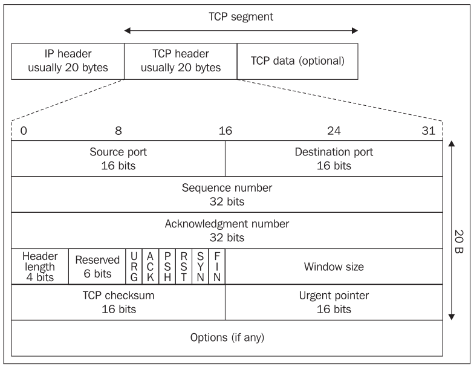
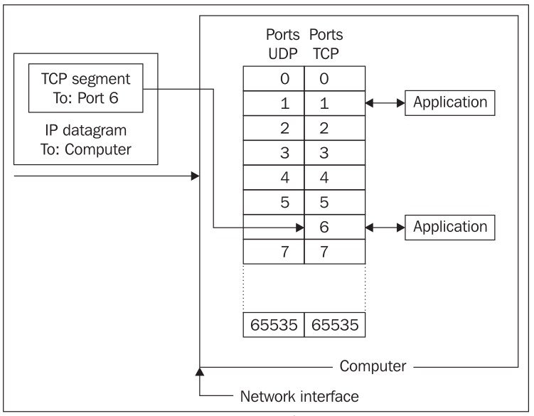

# Port

<!-- TOC -->

- [1. Intro Port](#1-intro-port)
  - [1.1. Computer Perspective](#11-computer-perspective)
  - [1.2. TCP/IP Protocol Perspective](#12-tcpip-protocol-perspective)
  - [1.3. Recap](#13-recap)
- [2. Port Classification](#2-port-classification)
  - [2.1. List of TCP and UDP port numbers](#21-list-of-tcp-and-udp-port-numbers)
  - [2.2. Well-known ports](#22-well-known-ports)
  - [2.3. Registered ports](#23-registered-ports)

<!-- /TOC -->

## 1. Intro Port

### 1.1. Computer Perspective

Each computer with an IP address has several thousand logical ports (`65,535` per transport layer protocol, to be precise). **These are purely abstractions in the computer’s memory and do not represent anything physical**, like a USB port. Each port is identified by a number between `1` and `65535`. Each port can be allocated to a particular service.

For example, HTTP, the underlying protocol of the Web, commonly uses port 80. We say that a web server listens on port 80 for incoming connections. When data is sent to a web server on a particular machine at a particular IP address, it is also sent to a particular port (usually port 80) on that machine. The receiver checks each packet it sees for the port and sends the data to any program that is listening to that port. This is how different types of traffic are sorted out.

### 1.2. TCP/IP Protocol Perspective

While IP transmits data between individual computers on the Internet, TCP transfers data between two actual applications running on these two computers. IP is used for data transfers between computers. An IP address is the address only of a computer's network interface, while TCP uses a port number as its address. If we were to compare this to a standard postal system, the IP address would be the building address and the port number (the address in TCP) would be the name of an actual resident in the building.

The ends of the connection (source and destination) are specified with the **port number**. **This number is two-byte**, so its value can vary between `0` and `65535`. Port numbers often express the fact that they are TCP ports with a backslash and the protocol name (tcp). UDP uses a different set of ports than TCP (also `0` to `65535`); so for example, port `53/tcp` has nothing in common with port `53/udp`.

### 1.3. Recap

无论是从Computer Perspective，还是从TCP/IP Protocol Perspective来说，都是对同一个事物（Port）进行解释。

从Computer Perspective的角度来说，Port在Computer当中的表示的是`1~65535`之间的一个数字，它是一个抽象，它能够与一个Service（应用程序）进行关联。

从TCP/IP Protocol Perspective角度来说，Port在TCP Segment当中占两个byte的数据信息。

## 2. Port Classification

Port numbers range from `0` to `65535`.

Port numbers are broken down into **three types**:

- **Well-known ports** (`0` to `1023`): These are port numbers that are used for relatively common services.
- **Registered ports** (`1024` to `49151`): These are port numbers that are assigned by IANA to a process.
- **Dynamic/private ports** (`49152` to `65535`): These are dynamically assigned to clients when a connection is initiated. These are normally temporary and cannot be assigned by IANA.

### 2.1. List of TCP and UDP port numbers

URL: [List of TCP and UDP port numbers](https://en.wikipedia.org/wiki/List_of_TCP_and_UDP_port_numbers)

### 2.2. Well-known ports

| Port | TCP           | UDP      | IANA status | Description                                                  |
| ---- | ------------- | -------- | ----------- | ------------------------------------------------------------ |
| 25   | Yes           | Assigned | Official    | Simple Mail Transfer Protocol(SMTP), used for email routing between mail servers |
| 80   | Yes, and SCTP | Assigned | Official    | Hypertext Transfer Protocol (HTTP)                           |
| 443  | Yes, and SCTP | Assigned | Official    | Hypertext Transfer Protocol over TLS/SSL (HTTPS)             |
|      |               |          |             |                                                              |
|      |               |          |             |                                                              |
|      |               |          |             |                                                              |
|      |               |          |             |                                                              |

### 2.3. Registered ports

| Port | TCP  | UDP      | IANA status | Description                                                  |
| ---- | ---- | -------- | ----------- | ------------------------------------------------------------ |
| 1433 | Yes  | Yes      | Official    | Microsoft SQL Server database management system (MSSQL) server |
| 3306 | Yes  | Assigned | Official    | MySQL database system                                        |
|      |      |          |             |                                                              |
|      |      |          |             |                                                              |
|      |      |          |             |                                                              |

